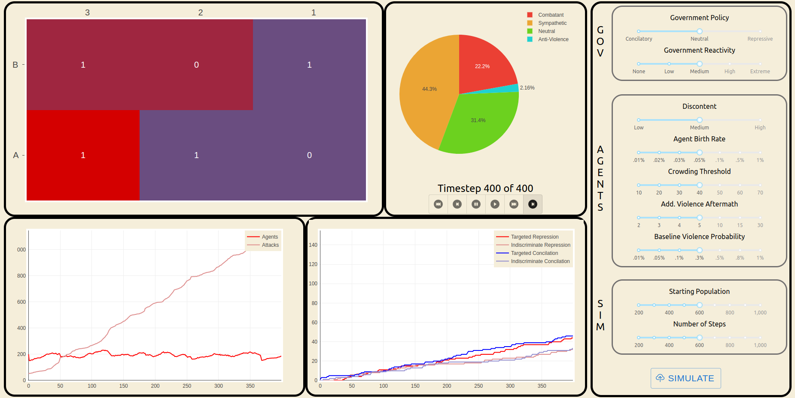

# Counterterrorism Simulations and Simulation Analyses

This repo contains multiple tools for developing and analyzing simulations of counterterrorism actions and terrorist attacks. While it is not intended to be a fully accurate representation of reality, and we acknowledge the many simplifications required to create models of the incredibly complex situations in which terrorism occurs, we hope that by creating a model which mimics some aspects of reality, social scientists may be able to use these simulations as research aids. By examining the differing impacts of parameters in the simulations and by comparing these simulation outputs to real-world data, we hope to spur new hypotheses and insights which can then be tested using traditional social science methods. The toolkit we developed contains the following:
* An agent-based model of terrorism developed in Python using the Mesa package. This base model can be run locally and as a GCP cloud function.
* An interactive dashboard to visualize the simulations step-by-step.
* Results from a large-scale run of thousands of simulations, run using MPI on UChicago's Midway 2, and a comparison of these results with real-world data to determine the most promising parameter combinations.
* An enhanced model which allows shifting parameters mid-way through the simulation, mirroring policy or government shifts. 


## Base Simulation

The base simulation is stored in model.py, and one example of running the model with desired parameters and analyzing the results is found in `local_model.ipynb`. Opening and running through the cells in `local_model.ipynb` is the simplest entry-point to become familiar with the model's functioning.  
This model was also uploaded as a Google Cloud Platform Cloud Function, enabling it to be called and run with any combination of parameters. 


## Interactive Visualization



The output of the model can also be visualized in an interactive React dashboard, with instructions below. First, to create the simulation data which the dashboard will use, you can either run the GCP Cloud Function above, or run a model locally using:  
  
`python counterterror_model_json_output.py --params='{"violence_prob": 0.0005,"gov_policy": "None","reactive_level": "none","discontent": "Mid","starting_pop": 200,"total_steps": 400,"add_violence_aftermath":10,"crowding_threshold":30,"agent_birth_rate":0.03}'`

The params are all optional, so you can set as many or as few as you want to change. They are described as follows:
 - `verbose` - flag to print out each step of the model as it occurs
 - `cloud` - flag to retreive simulation from the google cloud function. Note this requires an identity file to be in the base of the repo as described below.
 - `output_file` - string path to output. Default is `counterterrorism_dash/src/static/long_sim_response.json`, which is where the dashboard expects new responses to be (ie, if left unchanged, dashboard will react to new simulations).

To run the simulation in the cloud, you need to have a file in the repo's base directory called `.gcloud_identity.json`, which is a json with one key `id` and a value of your gcloud secret key. **This file is git ignored and should not be shared with anyone lest your credits be hijacked by crypto miners**. It is structured as follows:

```
{'id' : 'Funbd$578fGGsofo@#djv...'}
```

To build the React dashboard:

```
cd counterterrorism_dash
npm install
```

Then after it is built and node modules downloaded:
```
npm start
```

Then, in your browser, navigate to:
```
http://localhost:3000/
```

When the dashboard is active, it will react to new simulation runs. For example, rerunning the above python in bash
will update the model outcome automatically. As of now, the sliders to the right of the dashboard don't change the active simulation, as we were unable to change security settings of our cloud function to provide CORS preflight authorization to our responses (as modern browsers expect). Future work on this project (using a google account with less restricted credentials) would allow the simParams state to be sent to the google cloud function via a POST request (which is effectively what our python script does) - this functionality is outlined in fetchSim within `src/services/Services.js`.

## Large-Scale Simulation Runs

A combination of simulations with multiple combinations of parameters can be run using slurm on Mdidway 2. The .sbatch script is `run_model_mpi.sbatch`, and this runs `run_model_mpi.py`. Runs are distributed over multiple nodes using MPI, then result dataframes for each simulation are stored as pickled dictionaries of Pandas dataframes. The resulting pickled data from our run of 2700 parameter combinations is stored in `model_output`as `model_output_dfs.zip`. A list of all parameter combinations and the time to run these is also stored in `model_output/run_model_mpi.out`. 

### Comparisons of Simulations with Real-World Data

The simulations were compared with real-world data using the same datasource as Dugan and Chenoweth (2012) of terrorist attacks. The results from each simulation were distributed as-if occurring over the same time period as our real data, 1987-2004, and then both sets of monthly attack data were normalized for more accurate comparison.  
  
This comparison work is done in `compare_model_and_real_dists.ipynb` using the non-parametric Kolmogorov-Smirnov test to compare distributions of monthly attacks from the simulations with our real-world data. For the 2,700 simulations we created, 47 were similar at the 0.01 significance level.  

Additional comparative work was done in the R Markdown script stored in `r_optimal_transport_comparisons/`. This work attempts to compare distributions using optimal transport, but was unfortunately not successful due to differences in content and values between the observed and simulated data.  

## Mid-Simulation Parameter Changes

In order to perform further analysis on the simulations, such as considering whether a policy change or other change to the model's context mid-simulation, we also developed `rd_model.py` and the associated `rd_model_simulations.ipynb` notebook to demonstrate. This version of the model is identical to the original in `model.py`, except it accepts a new set of parameters to switch to half-way through the model's running. We believe this should allow for analyses such as a regression discontinuity, by comparing the effect of changing a single parameter from another while leaving all other parameters unchanged. 

## References

Dugan, L., & Chenoweth, E. (2012). Moving Beyond Deterrence: The Effectiveness of Raising the Expected Utility of Abstaining from Terrorism in Israel. American Sociological Review, 77(4), 597–624. https://doi.org/10.1177/0003122412450573

Kazil, J., Masad, D., & Crooks A., “Utilizing Python for Agent-Based Modeling: The Mesa Framework,” in Social, Cultural, and Behavioral Modeling, Cham, 2020, pp. 308–317.


